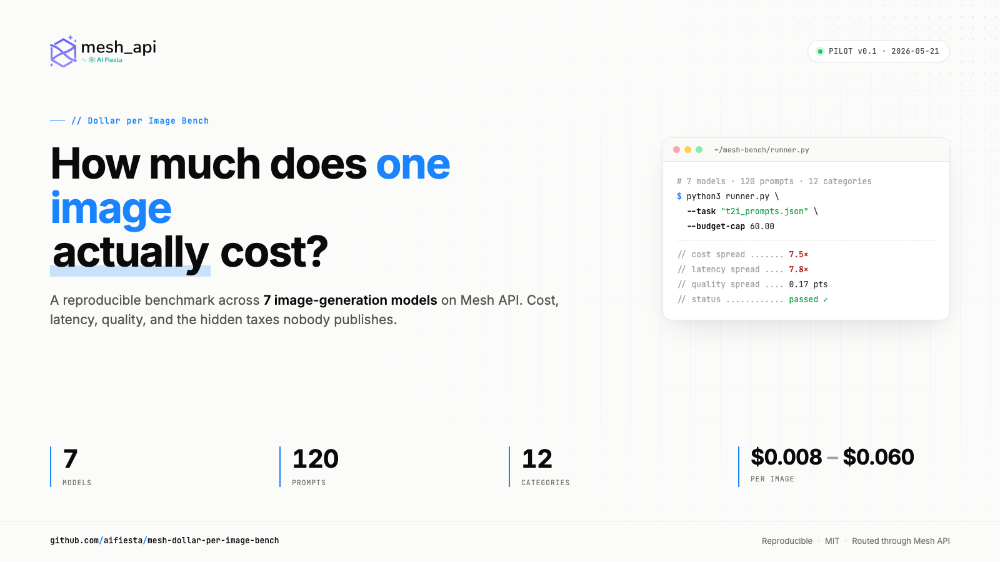

<p align="center">
  <a href="https://meshapi.ai">
    
  </a>
</p>

<p align="center">
  
</p>

<h1 align="center">Mesh Dollar per Image Bench</h1>

<p align="center">
  <strong>How much does one image <em>actually</em> cost to generate?</strong><br>
  A reproducible cost · latency · quality benchmark across 7 image-generation models<br>
  routed through <a href="https://meshapi.ai">Mesh API</a> — plus the hidden taxes nobody publishes.
</p>

<p align="center">
  <a href="paper/paper.html"></a>
  <a href="paper/mesh-dollar-per-image-bench.pdf"></a>
  <a href="LICENSE"></a>
  <a href="https://meshapi.ai"></a>
</p>

---

> **Status:** Pilot complete (n=5/category × 7 models × 12 categories). Full paper in [`paper/paper.html`](paper/paper.html) / [`paper/paper.md`](paper/paper.md). v1 expansion in progress.
>
> Sibling chat-LLM benchmark: [`aifiesta/mesh-bench-cost-vs-quality`](https://github.com/aifiesta/mesh-bench-cost-vs-quality)
> Index of public Mesh API benchmarks: [`aifiesta/mesh-benchmarks`](https://github.com/aifiesta/mesh-benchmarks)

## TL;DR

- A **$0.008** model ties a **$0.060** model on routine prompts. 7.5× cost spread, **0.17 quality-point** spread.
- Latency spread is **7.8×** at p50 (Imagen Fast 7s ↔ GPT-Image-2 57s).
- On hyper-complex prompts the most expensive model **drops to last place** (189s, 4–5× its own routine p50).
- All three Imagen models confidently label the right human lung as **"2 lobes"** when the correct answer is 3.
- Pricing-page $/image is honest. But quality-tier multipliers, resolution multipliers, refusal rate, watermarks, and retry billing — **the five hidden taxes** — are what move real cost at scale.

> Full numbers, ensemble agreement, refusal counts, and 56 hand-curated showcase renders live in [`paper/paper.html`](paper/paper.html).

## What we're measuring

For every (model × prompt) pair we capture:

| Dimension | How |
|---|---|
| **Cost** | Dated static pricing table (`pricing.json`) — image endpoints don't return `usage` |
| **Latency** | Wall-clock end-to-end (network + Mesh routing + provider queue + inference), p50 + p95 |
| **Quality** | 5-axis rubric (prompt adherence, aesthetic, photorealism, text rendering, anatomy/artifacts) scored 1–5 by two vision LLMs at two temperatures each |
| **Auto-alignment** | VQAScore + CLIPScore + aesthetic predictor as a local, free sanity baseline |
| **Hidden taxes** | Quality-tier inflation, resolution multiplier honesty, refusal rate, watermark presence, retry tax |

## The 12 prompt categories

Hand-written from scratch (no copy from PartiPrompts / DrawBench / GenAI-Bench / HEIM — only structural inspiration) to limit training-set contamination. 10 prompts per category, 120 prompts total.

| # | Category | Stresses |
|---|---|---|
| 1 | Photorealism / portrait | Face anatomy, skin, lighting |
| 2 | Typography | In-image Latin glyph fidelity |
| 3 | Compositional / spatial | "Red cube left of blue sphere" |
| 4 | Multi-subject coherence | Two+ named subjects, distinct attributes |
| 5 | Style transfer / artistic | "Watercolor", "polaroid", "Ghibli" |
| 6 | Long prompt fidelity | 100+ words, 5+ attributes |
| 7 | Knowledge / world facts | Named landmarks and places |
| 8 | Counting / numerical | "Exactly four apples" |
| 9 | Negative space / minimalism | "Single line, lots of empty space" |
| 10 | Edge cases / policy | Brand-adjacent, NSFW-boundary, watermark-prone |
| 11 | **Multilingual** | Non-Latin script + cultural context (Devanagari, Chinese, Arabic, Japanese, Cyrillic, Hangul, Greek, Hebrew, Thai, accented Spanish) |
| 12 | **Hyper-complex** | Boss-fight prompts: 10+ named entities, positions, counts, in-image text, scene-knowledge simultaneously |

## The five hidden taxes

The point of this benchmark. Pricing pages tell you the per-image $; nothing tells you these.

1. **Quality-tier inflation** — does `quality: "high"` actually look 4× better than `"medium"` given it costs ~4×?
2. **Resolution multiplier honesty** — does `1024×1536` cost 1.5× `1024×1024`, or 2–3× via pixel-count billing?
3. **Refusal rate** — fraction of edge-case prompts each model silently refuses or rewrites.
4. **Watermark presence** — which providers stamp generations and how visibly.
5. **Retry tax** — do retried-after-rate-limit calls still get billed?

Each has a dedicated column in `data/pilot_results.csv` and a section in the paper.

## Reproduce in 5 minutes

```bash
# 1. Install
pip install openai pillow matplotlib pandas requests
# Optional: pip install open_clip_torch t2v-metrics   # for automatic metrics

# 2. Configure
cp .env.example .env
# Edit .env: MESH_API_KEY, MESH_BASE_URL=https://api.meshapi.ai/v1

# 3. Verify pipeline (no API calls, ~5s)
python3 smoke_test.py

# 4. Discover routable image models (~1 free API call)
python3 discover.py

# 5. Sanity ping (~$0.01) — auth + pricing + image download
python3 -c "
from runner import call_image_model, save_image
out = call_image_model(model='openai/gpt-image-1',
    prompt='a single red apple, photorealistic',
    size='1024x1024', quality='low')
print(f'OK in {out[\"latency_ms\"]}ms, ${out[\"raw_cost_usd\"]}')
save_image(out['image_url'], None, 'sanity/ping')
"

# 6. Pilot run (5 prompts × N models, ~$2–4 total, ~5–10 min)
python3 runner.py --task tasks/t2i_prompts.json \
  --out data/pilot_t2i.csv --limit 5 --budget-cap 5

# 7. Score (vision ensemble + automatic metrics)
python3 judge.py --task tasks/t2i_prompts.json \
  --runs data/pilot_t2i.csv --out data/judged_t2i.csv

# 8. Aggregate & visualize
python3 aggregate.py --judged data/judged_t2i.csv --out data/pilot_results.csv
python3 make_charts.py
python3 make_tables.py
```

## Repository layout

```
.
├── assets/                  Brand logos (light + dark)
├── charts/                  Rendered chart PNGs (chart_1…chart_6)
├── tables/                  Rendered table PNGs (table_1…table_5)
├── data/                    Pilot/judged CSVs, models_catalog.json, pilot_results.{csv,json}
├── images/                  Generated images, organised by provider/model
│   ├── openai/
│   │   ├── gpt-image-1/
│   │   ├── gpt-image-1.5/
│   │   ├── gpt-image-1-mini/
│   │   └── gpt-image-2/
│   └── google/
│       ├── imagen-3/
│       ├── imagen-4-fast/
│       └── imagen-4-ultra/
├── paper/                   paper.html · paper.md · PDF · build_pdf.py · x_article.md
├── tasks/                   t2i_prompts.json · edit_prompts.json · category samples
├── runner.py                POST /v1/images/generations per (model, prompt), download + CSV
├── judge.py                 Orchestrator — joins vision ensemble + automatic scores
├── judge_vision.py          Claude-vision + GPT-vision (5 axes × 2 temperatures)
├── judge_auto.py            VQAScore + CLIPScore + aesthetic predictor (local, free)
├── aggregate.py             Per-model summaries with hidden-tax columns
├── cost_estimator.py        Dry-run cost projection from pilot CSVs
├── discover.py              GET /v1/models, filter image-output, probe /v1/images/edits
├── make_charts.py           Renders chart PNGs → charts/
├── make_tables.py           Renders table PNGs → tables/
├── smoke_test.py            Mocked-Mesh end-to-end pipeline check (no spend)
├── models.py                Candidate MODELS list + tier metadata
├── pricing.json             Dated (model, size, quality) → $/image table
├── cover.{html,png}         Repo cover artwork
└── README.md
```

## Cost projection

| Phase | Calls | Estimated $ |
|---|---:|---:|
| Discover + sanity ping | 2 | <$0.05 |
| Pilot (T2I) | 25 | $2–4 |
| Pilot judging (vision ensemble) | 100 | $0.50–1.50 |
| **Pilot total** | **~125** | **$3–6** |
| Full run (T2I, n=10/category × 8 models) | 800 | $15–35 |
| Full judging | 3,200 | $8–18 |
| **Full total** | **~4,000** | **$25–55** |

Budget enforced by `--budget-cap` on `runner.py` (hard stop mid-run).

## Methodology in one paragraph

Every call uses the same prompt, the same size (`1024×1024` default), `n=1`, and the same deterministic seed where the model supports it. Cost comes from `pricing.json` — a static `(model, size, quality) → $/image` table dated 2026-05-20, sourced from each provider's official pricing page (no token-estimation; image endpoints don't return `usage`). Quality is scored by an ensemble of two vision LLMs (Claude Opus 4.7-vision + GPT-5.5-vision), each at temperature 0.0 and 0.3, on five 1-5 axes. Variance between passes is reported alongside the score. Automatic metrics (VQAScore + CLIPScore + aesthetic predictor) run locally for free as a sanity baseline. Latency is end-to-end wall-clock, reported as p50 and p95. Content-policy refusals are tracked as a separate bucket from passes/fails. The five hidden taxes each get a dedicated column in `data/pilot_results.csv` and a paragraph in the paper.

## What this benchmark deliberately does not cover

- **Latency is end-to-end wall-clock**, not isolated inference time. Network + Mesh routing + provider queue included.
- **Pilot n=5/category, full n=10/category.** Big enough for headline gaps, not tight confidence intervals.
- **Models not on Mesh aren't in the lineup.** If FLUX / Midjourney / Recraft aren't routable through Mesh, that's a Mesh-coverage finding — not a model gap we paper over with a direct-provider fallback.
- **Two-judge ensemble, not human eval.** v2 may add a 50-prompt human-rated calibration set if agreement turns out poor.
- **Single seed, single region, single time-of-day, single run.** No confidence intervals; provider throttling and queue depth vary by hour.
- **No upscaling, no post-processing, no LoRAs.** Stock model output only.
- **No video, 3D, or audio.** Separate benchmarks.

## Roadmap

- ✅ **Pilot** — n=5/category × 7 models, full hidden-tax breakdown, paper published.
- **v1** — n=10/category × ~8 models, expanded showcase, blog launch.
- **v2** — image editing (if Mesh ships `/v1/images/edits`), 50-prompt human calibration set, p99 latency, +2-3 models as Mesh expands its image catalog.

## About Mesh API

<p>
  <a href="https://meshapi.ai">
    
  </a>
</p>

[**Mesh API**](https://meshapi.ai) is a unified LLM and image-model gateway: **one API key, 300+ models** across OpenAI, Anthropic, Google, Meta, Mistral, DeepSeek, Alibaba, and more — OpenAI-compatible, so the same code that talks to GPT also talks to Imagen, Claude, Gemini, or Llama. Change the model name in the request; leave everything else alone.

- **Zero platform fees for 12 months.** You only pay for tokens / images.
- **Smart auto routing.** `route: cheapest | fastest | balanced` and the gateway picks for you.
- **Automatic failover.** If a provider goes down, your request reroutes. Your users don't notice.
- **Highest pooled rate limits.** Capacity is shared across providers, so you hit ceilings later than going direct.
- **Zero data retention.** Prompts and completions pass through; nothing is stored.
- **Multi-currency billing.** USD and INR at launch.
- **Ready-made workflows.** Pre-built prompt templates plug into any model.
- **Full observability.** Every request, token, cost, error, and model in real time. Per-key spend limits.

Built by the founders of [TagMango](https://tagmango.com) (YC W20) and [AI Fiesta](https://aifiesta.ai) (1M+ users across India). We got tired of juggling five provider dashboards ourselves, so we built this.

## Contributing

If you run this against a different model lineup (different Mesh-routable models, or your own direct-provider configuration) and get different numbers, please open an issue with the CSVs and we'll fold corrections into v2. PRs welcome for: additional models (only if Mesh-routable), additional prompt categories, judge-prompt improvements that boost ensemble agreement, automatic-metric upgrades.

## License

**MIT License.** Datasets, scripts, prompts, and raw CSVs are free to use, modify, and republish — including commercially. Copyright © 2026 Fiesta Labs Inc. Attribution appreciated, not required.

---

<p align="center">
  Published by <strong>Raushan Sharma</strong> · drop a line to
  <a href="mailto:raushan@meshapi.ai">raushan@meshapi.ai</a><br>
  if anything here is unclear, broken, or you want to understand the methodology better.
</p>

<p align="center">
  <a href="https://meshapi.ai">
    
  </a>
</p>
